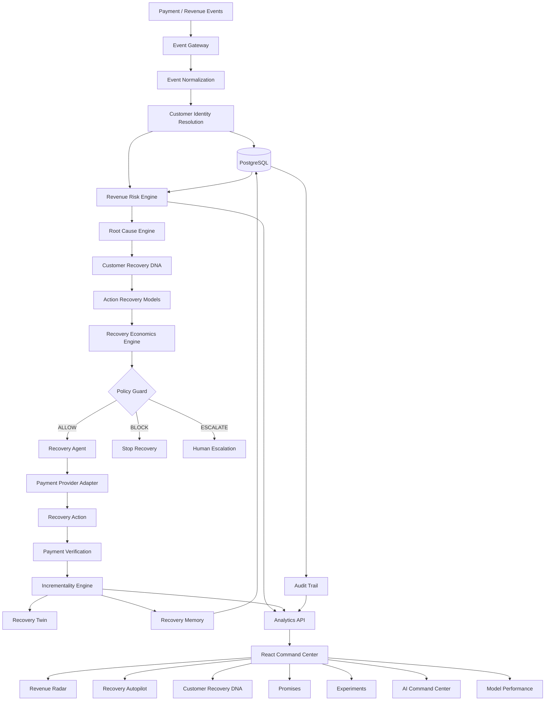

# DhanRakshak

### Every rupee deserves a second chance.

**DhanRakshak is an AI-powered Revenue Recovery Control Plane that detects revenue at risk, identifies why it is leaking, predicts the most effective recovery action, executes it within deterministic guardrails, verifies the outcome and measures the incremental revenue recovered.**

---

## 🚀 Overview

Revenue doesn't only disappear when a payment fails.

It leaks through:

- Failed payments
- Abandoned checkouts
- Subscription failures
- Overdue invoices
- Ineffective retries
- Payment-method degradation
- Missed promises-to-pay
- Customer recovery fatigue
- Poorly timed interventions
- Unnecessary discounts
- Revenue that would have recovered anyway

Traditional payment systems primarily answer:

> **"What failed?"**

DhanRakshak answers:

> **"Which revenue is at risk, why is it at risk, what should we do next, and how much incremental revenue can that action recover?"**

DhanRakshak combines **machine learning, customer behavior intelligence, AI reasoning, recovery economics, deterministic policies, payment execution, and incrementality measurement** into one intelligent revenue recovery system.

---

# 🎯 The Core Idea

DhanRakshak follows a simple but powerful loop:

```text
                 REVENUE EVENT
                       │
                       ▼
                 ┌───────────┐
                 │  DETECT   │
                 │ Revenue   │
                 │   Risk    │
                 └─────┬─────┘
                       ▼
                 ┌───────────┐
                 │ DIAGNOSE  │
                 │ Root Cause│
                 └─────┬─────┘
                       ▼
                 ┌───────────┐
                 │  PREDICT  │
                 │ Best Action│
                 └─────┬─────┘
                       ▼
                 ┌───────────┐
                 │ SIMULATE  │
                 │ Economics │
                 └─────┬─────┘
                       ▼
                 ┌───────────┐
                 │   POLICY  │
                 │   GUARD   │
                 └─────┬─────┘
                       ▼
                 ┌───────────┐
                 │  EXECUTE  │
                 │ Recovery  │
                 └─────┬─────┘
                       ▼
                 ┌───────────┐
                 │  VERIFY   │
                 │  Outcome  │
                 └─────┬─────┘
                       ▼
                 ┌───────────┐
                 │  MEASURE  │
                 │ Incremental│
                 │  Revenue  │
                 └─────┬─────┘
                       │
                       └────────► LEARN
````

---

# 💡 Why DhanRakshak?

### Traditional recovery

```text
Payment Failed
      ↓
Retry
      ↓
Retry Again
      ↓
Send Reminder
      ↓
Hope It Works
```

### DhanRakshak

```text
Payment Failed
      ↓
Why did it fail?
      ↓
How risky is this revenue?
      ↓
What has worked for this customer?
      ↓
Which intervention has the highest expected value?
      ↓
Is the action allowed?
      ↓
Execute
      ↓
Verify
      ↓
Measure incremental recovery
```

The objective isn't to maximize recovery attempts.

## The objective is to maximize incremental revenue while minimizing customer friction.

---

# 🏗️ System Architecture



---

# 🧠 Architecture Philosophy

DhanRakshak deliberately separates **AI intelligence from financial authority**.

```text
┌────────────────────────────────────────────┐
│                  AI LAYER                  │
│                                            │
│ Reasoning • Root Cause • Explanations     │
│ Promise Extraction • Message Generation   │
└──────────────────────┬─────────────────────┘
                       │
                       ▼
┌────────────────────────────────────────────┐
│              ML DECISION LAYER             │
│                                            │
│ Risk • Action Probability • Incrementality│
│ Recovery Economics                         │
└──────────────────────┬─────────────────────┘
                       │
                       ▼
┌────────────────────────────────────────────┐
│               POLICY AUTHORITY              │
│                                            │
│ ALLOW • BLOCK • ESCALATE                   │
│                                            │
│ Deterministic Financial Guardrails         │
└──────────────────────┬─────────────────────┘
                       │
                       ▼
┌────────────────────────────────────────────┐
│              EXECUTION LAYER               │
│                                            │
│ Payment Links • Retry • Notifications     │
│ Promise Tracking • Human Escalation       │
└────────────────────────────────────────────┘
```

### AI recommends.

### Models quantify.

### Policy controls.

### Backend executes.

### Verification confirms.

### Audit records.

---

# 🔎 01 — Revenue Leakage Radar

DhanRakshak continuously monitors revenue signals to identify money that is likely to become unrecovered.

### Signals include

* Failed payments
* Subscription failures
* Overdue invoices
* Abandoned checkouts
* Repeated payment failures
* Payment-method degradation
* Missed promises-to-pay
* Recovery fatigue
* Sudden customer behavior changes
* Revenue concentration anomalies

The system converts these signals into an actionable risk view:

```text
TOTAL REVENUE AT RISK
          │
     ┌────┼────┐
     ▼    ▼    ▼
   HIGH  MEDIUM LOW
```

Each risk signal is accompanied by supporting evidence and context.

---

# 👤 02 — Customer Recovery DNA

Every customer has a unique recovery pattern.

DhanRakshak builds a dynamic recovery profile from historical behavior.

### Example

```text
CUSTOMER
Acme Technologies

────────────────────────────────────

Preferred Payment
UPI

Preferred Channel
Payment Link

Best Recovery Window
18:00 – 21:00

Payment Success Rate
92%

Historical Recovery Rate
87%

Average Recovery Time
3.2 hours

Promise Reliability
94%

Recovery Fatigue
LOW

Best Performing Action
Payment Link
```

Instead of asking:

> "What normally works?"

DhanRakshak asks:

> **"What has historically worked for this specific customer?"**

---

# 🧩 03 — Root Cause Intelligence

A payment failure is not always the actual reason revenue is at risk.

DhanRakshak combines event history, payment behavior, customer context, and recovery history to determine the most likely root cause.

### Example

```text
Payment Failed
      ↓
Authentication Failure
      ↓
2 Previous Card Failures
      ↓
UPI Success Rate = 94%
      ↓
Previous UPI Recovery Success
      ↓
RECOMMENDATION
Generate UPI Payment Link
```

Root-cause explanations are grounded in stored application data.

---

# 💰 04 — Recovery Economics Engine

A recovery action is not valuable simply because it has a high probability of success.

DhanRakshak optimizes for **Expected Incremental Recovery Value**.

### Conceptual objective

```text
Expected Incremental Revenue

= Recoverable Amount
× P(Recovery)
× P(Incremental Recovery)

− Intervention Cost
− Customer Friction
− Risk Penalty
```

The engine evaluates actions such as:

```text
Retry
Payment Link
WhatsApp
Email
SMS
Delayed Retry
Promise-to-Pay
Human Escalation
No Action
```

This lets DhanRakshak choose the action that provides the best expected economic outcome rather than blindly maximizing attempts.

---

# 🪞 05 — Recovery Twin

One of DhanRakshak's key ideas is separating **recovered revenue** from **incremental recovered revenue**.

The Recovery Twin compares:

```text
              WITHOUT              WITH
             DHANRAKSHAK        DHANRAKSHAK

Revenue
At Risk          ₹X                  ₹X

Organic
Recovery         ₹Y                  ₹Y

Assisted
Recovery          —                  ₹Z

Incremental
Recovery          —                  ₹Z
```

The question becomes:

> **"How much additional revenue did DhanRakshak actually create?"**

This prevents the system from taking credit for revenue that would have recovered naturally.

---

# 📈 06 — Incrementality Engine

Not every successful payment is caused by an intervention.

DhanRakshak therefore distinguishes:

```text
Gross Recovery
      ↓
Estimated Organic Recovery
      ↓
Incremental Recovery
```

Where appropriate, randomized control/treatment experiments can be used to estimate intervention uplift.

### Key measurements

* Recovery rate
* Incremental recovery
* Treatment vs control uplift
* Action-level performance
* Expected vs actual recovery
* Recovery time
* Revenue recovered per intervention

---

# 🛡️ 07 — Policy Guard

Financial automation needs deterministic boundaries.

DhanRakshak's Policy Guard is the final authority before an action can be executed.

### Example policy

```text
Maximum attempts                 3
Messages / 7 days                2
Maximum recovery actions         3
Maximum discount                 10%
Human escalation above           ₹1,00,000
Minimum model confidence          0.65
```

### Automatically stop when

```text
✓ Payment succeeds
✓ Customer opts out
✓ Dispute is detected
✓ Fraud signal appears
✓ Recovery limit is reached
```

Every policy decision is logged:

```text
Policy ID
Decision
Rules Evaluated
Rules Failed
Reason
Timestamp
Model Version
Action
Outcome
```

The AI cannot bypass these controls.

---

# 🤖 08 — Recovery Agent

The recovery agent operates inside a bounded state machine.

```text
DETECTED
   ↓
DIAGNOSED
   ↓
RECOMMENDED
   ↓
POLICY_CHECKED
   ↓
EXECUTED
   ↓
VERIFICATION_PENDING
   ↓
RECOVERED
```

Possible alternative outcomes:

```text
FAILED
STOPPED
ESCALATED
```

### Agent tools

```text
get_customer_history()
get_transaction_history()
get_revenue_risk()
get_root_cause()

predict_action_recovery()
calculate_expected_recovery()

check_policy()

create_payment_link()
schedule_retry()
send_notification()

record_promise_to_pay()

escalate_to_human()
stop_recovery()

record_recovery_outcome()
```

The agent cannot directly execute a financial action without passing through the Policy Guard.

---

# 💬 09 — Promise-to-Pay Intelligence

DhanRakshak can convert natural-language payment commitments into structured recovery workflows.

### Example

> "Monday ko ₹50,000 clear kar dunga."

The system extracts:

```json
{
  "amount": 50000,
  "promised_date": "Monday",
  "confidence": 0.96
}
```

Then:

```text
Promise Detected
      ↓
Promise Recorded
      ↓
Reminder Scheduled
      ↓
Payment Link Generated
      ↓
Payment Verified
      ↓
Promise Closed
```

If the promise is missed, the recovery strategy can be recalculated.

---

# 🧑‍💻 10 — AI Command Center

Instead of navigating through multiple dashboards, merchants can interact directly with their revenue data.

### Example queries

```text
"Show me the highest-value revenue at risk."

"Why is this subscription at risk?"

"Which recovery action should we use?"

"How much revenue was recovered incrementally?"

"Show customers with high recovery probability."

"Why was this customer escalated?"

"Which intervention performs best?"
```

The command center uses backend tools and stored data rather than generating unsupported dashboard information.

---

# ⚡ 11 — Recovery Autopilot

The Recovery Autopilot visualizes the complete decision and execution pipeline.

```text
SCANNING REVENUE EVENTS
          ↓
IDENTIFYING HIGH-RISK OPPORTUNITIES
          ↓
ANALYZING CUSTOMER RECOVERY DNA
          ↓
SIMULATING INTERVENTIONS
          ↓
APPLYING POLICY GUARDRAILS
          ↓
EXECUTING APPROVED ACTIONS
          ↓
VERIFYING PAYMENT OUTCOMES
          ↓
CALCULATING INCREMENTAL REVENUE
```

The interface follows the money:

```text
AT RISK
   ↓
INTELLIGENCE
   ↓
POLICY
   ↓
RECOVERY
   ↓
RECOVERED
```

---

# 🧪 Machine Learning Pipeline

DhanRakshak uses specialized models for specialized decisions.

```text
                         DATA
                           │
                           ▼
                    DATA VALIDATION
                           │
                           ▼
                  FEATURE ENGINEERING
                           │
             ┌─────────────┼─────────────┐
             ▼             ▼             ▼
        Risk Model    Action Model   Uplift Model
             │             │             │
             └─────────────┼─────────────┘
                           ▼
                  Recovery Economics
                           │
                           ▼
                      Policy Guard
                           │
                           ▼
                    Recovery Action
```

---

## Model 01 — Revenue Risk Model

Predicts:

> **The probability that a revenue event remains unrecovered without intervention.**

### Example features

* Transaction amount
* Payment method
* Failure reason
* Retry count
* Customer lifetime value
* Payment success rate
* Recovery history
* Days overdue
* Subscription status
* Checkout stage
* Customer tenure
* Previous interventions
* Time/day behavior
* Customer segment

---

## Model 02 — Action Recovery Model

Estimates:

> **P(Recovery | Customer, Event, Action)**

for each available intervention.

Example actions:

```text
Retry
Payment Link
WhatsApp
Email
SMS
Delayed Retry
Promise-to-Pay
Human Escalation
No Action
```

---

## Model 03 — Incrementality Model

Estimates:

> **How likely the customer would have recovered without the intervention.**

This allows DhanRakshak to estimate the actual incremental value created by an intervention.

---

# 📊 Model Evaluation

The platform evaluates models using:

```text
ROC-AUC
PR-AUC
Precision
Recall
F1
Brier Score
Calibration
Precision@K
Action-level Recovery Rate
Treatment vs Control Recovery
Uplift / Qini
```

Metrics displayed by the application are generated from trained model artifacts and evaluation data.

**No model performance numbers are hardcoded.**

---

# 🗃️ Data Architecture

DhanRakshak works with interconnected revenue entities:

```text
CUSTOMERS
    │
    ├── TRANSACTIONS
    │
    ├── SUBSCRIPTIONS
    │
    ├── INVOICES
    │
    ├── CHECKOUT SESSIONS
    │
    ├── RECOVERY EVENTS
    │
    ├── PROMISES
    │
    └── EXPERIMENTS
```

### Customer-level intelligence

```text
Payment Success Rate
Recovery Success Rate
Preferred Payment Method
Preferred Channel
Average Order Value
Lifetime Value
Customer Tenure
Recovery Fatigue
Promise Reliability
Average Recovery Time
Previous Failed Attempts
```

---

# 🔬 Data Quality & Leakage Prevention

The ML pipeline validates:

* Duplicate identifiers
* Negative amounts
* Invalid timestamps
* Impossible event sequences
* Invalid customer references
* Invalid payment methods
* Invalid recovery actions
* Recovered amount exceeding original amount
* Target leakage
* Future information entering historical features

For realistic evaluation, the dataset is split chronologically:

```text
PAST
 │
 ├── TRAIN
 │
 ├── VALIDATION
 │
 └── FUTURE TEST
                          → TIME
```

This better represents production-style model evaluation.

---

# 🔌 Integration Architecture

DhanRakshak uses a provider abstraction so the intelligence layer remains independent of provider-specific payloads.

```text
                 PaymentProvider
                       │
              ┌────────┴────────┐
              │                 │
        Demo Adapter      Payment Adapter
```

### Event flow

```text
Payment Event
     ↓
Webhook Gateway
     ↓
Signature Validation
     ↓
Idempotency Check
     ↓
Event Normalization
     ↓
Revenue Intelligence
     ↓
Policy Guard
     ↓
Recovery Action
     ↓
Payment Verification
```

### Integration safeguards

* Signature validation
* Idempotency
* Duplicate protection
* Replay protection
* Structured logging
* Secret isolation
* No secret logging

---

# 🎬 Demo Scenarios

DhanRakshak includes deterministic benchmark scenarios covering different recovery decisions.

| Case |    Amount | Situation                 | Decision                |
| ---- | --------: | ------------------------- | ----------------------- |
| 01   | ₹2,40,000 | Overdue invoice           | UPI Payment Link        |
| 02   |    ₹8,499 | Card failed twice         | Alternate payment route |
| 03   |   ₹12,999 | Abandoned checkout        | Timed intervention      |
| 04   |   ₹50,000 | Promise-to-pay            | Scheduled recovery      |
| 05   | ₹1,85,000 | High-value / uncertain    | Human escalation        |
| 06   |         — | Customer opted out        | Stop                    |
| 07   |         — | Payment already succeeded | Stop                    |

The benchmark environment uses synthetic/simulated data and is clearly separated from production data.

---

# 🧩 Product Modules

| Module                    | Purpose                                        |
| ------------------------- | ---------------------------------------------- |
| **Revenue Radar**         | Detect revenue at risk                         |
| **Recovery Autopilot**    | Execute controlled recovery workflows          |
| **Customer Recovery DNA** | Understand customer-specific recovery behavior |
| **Promises**              | Track natural-language payment commitments     |
| **Recovery Twin**         | Estimate incremental revenue                   |
| **Experiments**           | Measure intervention performance               |
| **AI Command Center**     | Query revenue intelligence conversationally    |
| **Audit Trail**           | Track every decision and action                |
| **Model Performance**     | Monitor ML quality and calibration             |
| **Integrations**          | Connect payment providers and event sources    |

---

# 🛠️ Technology Stack

## Frontend

* React
* TypeScript
* Vite
* Tailwind CSS
* Framer Motion
* Recharts
* Lucide React

## Backend

* Python
* FastAPI
* Pydantic
* SQLAlchemy
* Alembic
* PostgreSQL

## Machine Learning

* pandas
* NumPy
* scikit-learn
* XGBoost

## AI

* LLM provider abstraction
* Tool-based agent architecture
* Structured outputs
* Deterministic execution boundaries

## Infrastructure

* Docker
* Docker Compose
* Vercel
* Render
* PostgreSQL

---

# 📁 Project Structure

```text
DhanRakshak/
│
├── frontend/
│   ├── src/
│   │   ├── components/
│   │   ├── pages/
│   │   ├── hooks/
│   │   ├── services/
│   │   └── lib/
│   └── package.json
│
├── backend/
│   ├── app/
│   │   ├── api/
│   │   ├── agents/
│   │   ├── integrations/
│   │   ├── ml/
│   │   ├── models/
│   │   ├── policies/
│   │   ├── schemas/
│   │   ├── services/
│   │   └── main.py
│   │
│   ├── data/
│   │   ├── raw/
│   │   ├── processed/
│   │   ├── train/
│   │   ├── validation/
│   │   └── test/
│   │
│   ├── models/
│   │   ├── revenue_risk/
│   │   ├── action_recovery/
│   │   └── incrementality/
│   │
│   └── tests/
│
├── docker-compose.yml
├── .env.example
└── README.md
```

--
# 🚀 Deployment

DhanRakshak is designed for a separated production architecture.

```text
                         INTERNET
                            │
                            ▼
                 ┌───────────────────┐
                 │      Vercel       │
                 │ React Application │
                 └─────────┬─────────┘
                           │
                           ▼
                 ┌───────────────────┐
                 │      Render       │
                 │    FastAPI API    │
                 └─────────┬─────────┘
                           │
             ┌─────────────┼─────────────┐
             ▼             ▼             ▼
       ┌──────────┐  ┌───────────┐  ┌──────────┐
       │PostgreSQL│  │ ML Models │  │ Payment  │
       │          │  │           │  │ Provider │
       └──────────┘  └───────────┘  └──────────┘
```

### Frontend

```text
GitHub
   ↓
Vercel
   ↓
React Production Build
```

### Backend

```text
GitHub
   ↓
Render
   ↓
FastAPI
   ↓
PostgreSQL
```

---

# 🎨 Design Philosophy

DhanRakshak is designed as a **premium fintech command center**, rather than a generic admin dashboard.

### Visual principles

* Dark premium interface
* High information density
* Large financial metrics
* Thin borders
* Controlled gradients
* Subtle glass effects
* Smooth micro-interactions
* Motion-driven state transitions
* Data-first visualization
* Responsive layouts
* Minimal visual noise

The primary product narrative is:

```text
REVENUE AT RISK
       ↓
WHY
       ↓
WHAT WILL WORK
       ↓
POLICY
       ↓
RECOVERY
       ↓
INCREMENTAL REVENUE
```

---

# 🏆 What Makes DhanRakshak Different?

| Capability                         | DhanRakshak |
| ---------------------------------- | :---------: |
| Revenue risk prediction            |      ✓      |
| Root-cause intelligence            |      ✓      |
| Customer Recovery DNA              |      ✓      |
| Action-level recovery prediction   |      ✓      |
| Recovery economics                 |      ✓      |
| Incremental revenue measurement    |      ✓      |
| Recovery Twin                      |      ✓      |
| Promise-to-pay intelligence        |      ✓      |
| Policy-aware AI agent              |      ✓      |
| Deterministic financial guardrails |      ✓      |
| Recovery fatigue                   |      ✓      |
| Experimentation                    |      ✓      |
| Human escalation                   |      ✓      |
| Full audit trail                   |      ✓      |
| Provider abstraction               |      ✓      |
| Multilingual recovery intelligence |      ✓      |

---

# 🔒 Safety by Design

DhanRakshak is built around a simple principle:

> **Autonomy without control is a liability.**

Therefore:

### AI does not control money.

The system separates:

```text
AI Reasoning
     +
ML Prediction
     +
Deterministic Policy
     +
Backend Execution
     +
Payment Verification
     +
Auditability
```

Critical events are explicitly handled:

* Customer opt-out
* Successful payment
* Dispute
* Fraud signal
* Excessive recovery attempts
* Low model confidence
* High-value transactions
* Duplicate events
* Failed execution

When confidence is insufficient, DhanRakshak can choose:

> **ESCALATE TO HUMAN**

instead of pretending to know.

---

# 📊 Example Decision

Consider a ₹2,40,000 overdue invoice.

The system sees:

```text
Amount
₹2,40,000

Customer
Enterprise

Previous Payment Method
UPI

UPI Success Rate
94%

Previous Recovery via Payment Link
High

Days Overdue
12

Recovery Risk
HIGH
```

DhanRakshak evaluates:

```text
Retry
        ↓
Expected Value: ₹X

Payment Link
        ↓
Expected Value: ₹Y

Email
        ↓
Expected Value: ₹Z

Human Escalation
        ↓
Expected Value: ₹W
```

The Recovery Economics Engine selects the highest expected incremental value that also satisfies the Policy Guard.

Then:

```text
POLICY → ALLOW
     ↓
ACTION → PAYMENT LINK
     ↓
PAYMENT → VERIFIED
     ↓
RECOVERY → RECORDED
     ↓
INCREMENTAL VALUE → CALCULATED
```

Every step is traceable.

---

# 🌏 India-Native Intelligence

DhanRakshak is designed for multilingual customer interactions.

Supported language contexts can include:

```text
English
Hindi
Hinglish
Bengali
Tamil
Telugu
Marathi
Gujarati
Kannada
Malayalam
```

For example:

> "Monday ko ₹50,000 clear kar dunga."

can be interpreted as a structured promise-to-pay rather than treated as unstructured text.

---

# 🔭 Future Roadmap

### Phase 1 — Intelligent Recovery

* Revenue risk prediction
* Customer Recovery DNA
* Action recommendation
* Policy enforcement

### Phase 2 — Autonomous Recovery

* Bounded recovery agent
* Payment execution
* Promise-to-pay automation
* Human escalation

### Phase 3 — Revenue Intelligence

* Recovery Twin
* Incrementality measurement
* Intervention experiments
* Cross-channel optimization

### Phase 4 — Adaptive Revenue OS

* Continuous model learning
* Merchant-specific policies
* Dynamic recovery strategies
* Cross-provider intelligence
* Predictive revenue forecasting

---

# 💭 Product Philosophy

DhanRakshak is built around three principles.

## 01 — Recover More

Prioritize actions based on expected incremental revenue.

## 02 — Friction Less

Use the smallest effective intervention instead of repeatedly contacting customers.

## 03 — Explain Everything

Every important decision should have:

```text
Evidence
   +
Model Context
   +
Policy Context
   +
Action
   +
Outcome
```

---

# 🚨 From Reactive Recovery to Intelligent Revenue Operations

Traditional recovery:

```text
FAILED PAYMENT
      ↓
RETRY
      ↓
RETRY
      ↓
REMINDER
```

DhanRakshak:

```text
UNDERSTAND
     ↓
PREDICT
     ↓
OPTIMIZE
     ↓
CONTROL
     ↓
ACT
     ↓
VERIFY
     ↓
LEARN
```

---

# 🌟 The Vision

Revenue recovery should not be a collection of retries and reminders.

It should be an intelligent system that understands:

```text
WHAT IS AT RISK
       +
WHY IT IS AT RISK
       +
WHO IS LIKELY TO PAY
       +
WHAT WILL MOST LIKELY WORK
       +
WHAT IS SAFE TO DO
       +
WHAT ACTUALLY CREATED VALUE
```

That is DhanRakshak.

---

# ⭐ DhanRakshak

### Every rupee deserves a second chance.

**Understand revenue. Predict recovery. Act intelligently. Measure what actually worked.**

```
```
